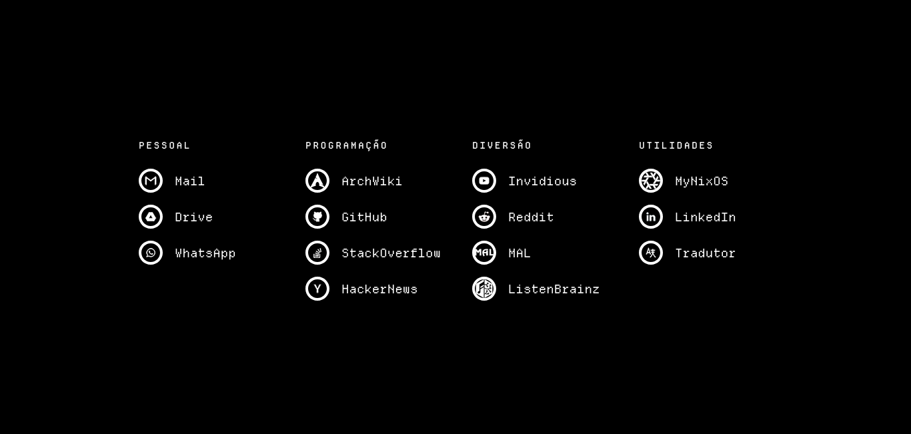

## Tweaking and Opinionated Purpose

While you can change it in [config.js](js/config.js), you might find it lacking since, slowly, customization is being depleted. Why? I use NixOS, a *declarative* system. My personal setup references this repository. It is easier to mantain if I have less to.

## Screenshots 

## Usage

To use Homepage as yourself, simply set your browser's home URL to
Homepage's index file.
To go to a site, enter the first letter of the site then hit enter.
To view the available sites, press `?` or click on the homedir.
If your input doesn't match any of the commands,
a generic DuckDuckGo HTML search will be triggered. For example:

- Entering `r` would redirect you to [www.reddit.com](https://www.reddit.com).
- Entering `w` would redirect you to [Whatsapp Web](https://web.whatsapp.com).
- Entering `cats` would search [Cats](https://html.duckduckgo.com/html/?q=cats).

Note that by default, queries are searched on DuckDuckGo but this can be
configured easily by updating two lines on. Check [Configuration](#configuration) for details.

You might have to allow pop-ups for your homepage to use quick launch feature.

## Searching

You can search any of the sites by typing a colon after the site's key, followed
by your search query. For example:

- Entering `g:tilde-enhanced` would search
  [GitHub for tilde-enhanced](https://github.com/search?q=tilde-enhanced).
- Entering `y:cats` would search
  [Cats on Invidious](https://inv.nadeko.net/search?q=cats).

## Specific Locations

You can go to a specific location on a site by typing a forward slash after the
site's key, followed by the location on the site you'd like to be redirected to.
For example:

- Entering `r/r/startpages` would redirect you to
  [www.reddit.com/r/startpages](https://www.reddit.com/r/startpages)

## URL Redirects

If you enter in a full domain or URL, you will be redirected to said domain or
URL. For example:

- Entering `stallman.org` would redirect you to
  [stallman.org](https://stallman.org/).
- Entering `keep.google.com` would redirect you to
  [keep.google.com](https://keep.google.com/).

You can also use `Ctrl + Enter` key combination to launch the query with a `.com` TLD.

## Query Paramater

Additionally, you can pass any query via the `q` query param. For example:

- Going to `file:///path/to/tilde/index.html?q=cats` would search
  [Cats](https://duckduckgo.com/?q=cats).

This allows you to invoke Homepage with your native browser search bar.

## Setting it up for new tabs on Firefox

By default Firefox won't let you set a custom URL for new tabs but there is a work-around to circumvent the problem.

You can follow [Urimu's Guide](https://github.com/Urimu/Startpage#setting-it-up-on-firefox) to set your new tab to launch custom URLs.

## License

To honor Ozencb, the OG creator of this marvelous web page, I'm keeping the [Unlicense](https://github.com/notawyvern/tilde-enhanced/blob/master/LICENSE). So feel free to steal with a legal wrath.

## Gratitude List

Homepage is largely based on [tilde-enhanced](https://github.com/ozencb/tilde-enhanced). That means without the following people, it wouldn't exist. So thank you!

[Cade Scroggins](https://github.com/cadejscroggins)

[ozencb](https://github.com/ozencb)
